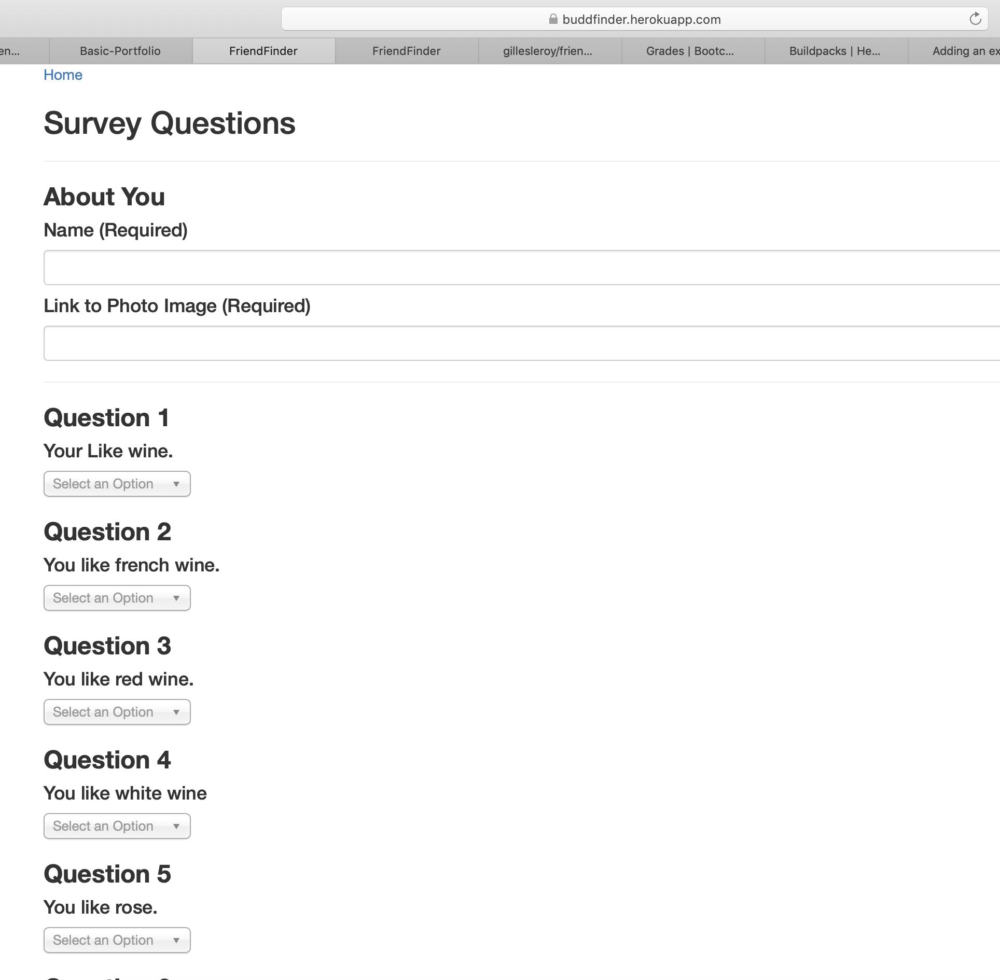

# friendfinder 
# Matching friends application
## UCB Extension Homework to demonstrate skills with routing and express
### This will allow a user to answer questions then get a best matching friend
### The user will enter answers by selecting from a drop down list
### Then click the Submit button when ready
### a popup window will display the resulting match name and picture
### See below screenshots of the action:

